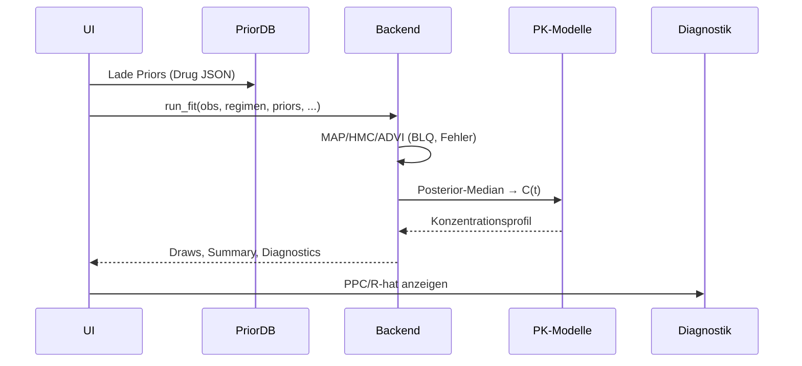

# ARCHITECTURE

Diese Datei beschreibt Schichten, Komponenten und Zuständigkeiten der Anwendung.

## Layer-Übersicht
- **Presentation (Shiny UI):** `app.R` – Tabs *Fit*, *Diagnostik*, *PTA/CFR*, *Szenarien*, *Admin*.
- **Application/Controller:** server-Logik in `app.R` orchestriert Inputs → Priors → Inferenz → Outputs → Audit.
- **Domain (PK/Fehler/Kovariaten):** `R/pk_models.R`, `R/error_models.R`, `R/units_checks.R`, `R/pediatric.R`, `R/crrt.R`, `R/nonlinear.R`, `R/tissue.R`.
- **Inference:** `R/backend_bayes.R`, `models/stan/*.stan`, `models/jags/*.jags`, `R/cache.R`, `R/diagnostics.R`.
- **Data Access & Config:** `R/prior_db.R`, `config/*.json|yaml`, `R/db.R` (optional Postgres), `audit/audit_log.csv`.
- **Reporting:** `R/reporting.R`, `report/report.Rmd`.
- **API:** `api/plumber.R` (Fit/Predict).

## Verzeichnisstruktur
```
app.R
R/
  backend_bayes.R  diagnostics.R  cache.R   design.R
  pk_models.R      error_models.R units_checks.R utils.R
  pediatric.R      crrt.R         nonlinear.R    tissue.R
  joint.R          prior_db.R     audit.R        auth.R   reporting.R  db.R
models/
  stan/pk_multicpt_ode.stan
  jags/pk_onecpt_inf.jags
api/plumber.R
priors/*.json
config/targets.json  config/tissue.json  config/users.yaml
report/report.Rmd
db/migrations/001_init.sql
```

## Komponenten (Kurzbeschreibung)
- **pk_models.R:** 1C analytisch; 2C/3C (ODE); *TVCL* für CRRT; Hooks für **MM** & **TMDD**.
- **error_models.R:** σ-Funktionen, **t-Residuen**, **Mixture**, **BLQ (M3)**-Likelihood.
- **backend_bayes.R:** Laplace/MAP; Stan (HMC) & **Stan-ADVI**; JAGS-1C; Diagnostics; Warm-Start Cache.
- **diagnostics.R:** **PPC**, R-hat/ESS-Tabelle.
- **design.R:** Vorschlag „nächster Samplingzeitpunkt“ (Varianz-Kriterium).
- **pediatric.R:** Maturationsfunktion (sigmoid) & Prior-Shifts (Gewicht/PMA).
- **crrt.R:** Parser + CL(t)-Beitrag aus Effluent/Sieving.
- **nonlinear.R:** **MM (1C)** & **TMDD-QSS** (1C, Skeleton).
- **joint.R:** weiche Kopplung CL ↔ Kreatinin (Penalty).
- **tissue.R:** Site-of-infection-Faktoren für PTA/CFR.
- **prior_db.R:** JSON-Priors laden/speichern (Admin).
- **reporting.R:** PDF-Render-Helper.
- **db.R:** Optionale Postgres-DAO (Audit etc.).
- **plumber.R:** `/healthz`, `/fit`, `/predict`.

## Datenmodelle (R-Objekte)
- **obs:** `tibble(time, conc)`  
- **regimen:** `list(dose, tau, tinf, n_doses, start_time)`  
- **covariates:** `list(age, weight, crcl, sex, is_neonate, PMA_weeks)`  
- **priors (JSON):** `theta` (nat. Skala), `theta_log$mu/sd` (log-Skala).  
- **draws:** `data.frame` θ-Samples (nat. Skala).  
- **posterior_summary:** `list(median, q2.5, q97.5)`.

## Sequenzdiagramm (Fit)


## Erweiterungs-Punkte
- **Drug-Pakete:** `priors/<Drug>.json` + (optional) model-spezifische Parameter.
- **Modelle:** `pk_models.R` & `models/stan/*.stan` (weitere Kompartimente/Nichtlinearitäten).
- **Backends:** neue `run_fit_*`-Implementierungen; Umschaltung via UI.
- **Tabs:** neue UI-Panels (Design, Optimierung, CFR-Feeds etc.).

## Technologiestack
- **R/Shiny**, **Stan** (cmdstanr/rstan), **JAGS**, **deSolve**, **plumber**, **Docker/Compose**, **Postgres** (optional).

### Optimierung (Phase 4)
- Modul: `R/optimize_regimen.R`
- UI: Tab „Optimierung“, Sidebar-Steuerung
- Dataflow: Draws → PTA/Risiko je Regime → Pareto → Empfehlung/Heatmaps
